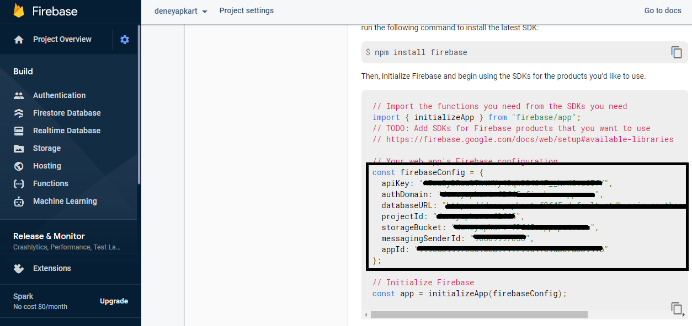
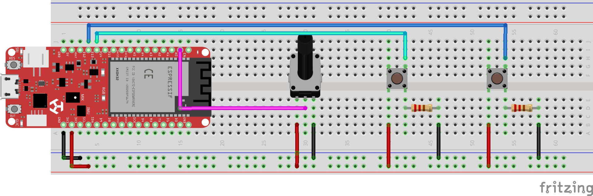

# 🎯 Deneyapkart JavaScript Firebase
Deneyapkart'tan alınan verilerin JavaScript ile Firebase gerçek zamanlı veritabanına kaydedilmesi - seri haberleşme örneği.

## 🧐 Kullanım
* Node, Arduino IDE ve Deneyap Kart Kütüphanesi'nin bilgisayarınızda kurulu olduğuna emin olun.
* Repo'yu klonlayın.
```bash
$ git clone https://github.com/orhanemree/deneyapkart-javascript-firebase.git
$ cd deneyapkart-javascript-firebase
```
* Deneyapkart ile şemadaki devreyi kurun ve kodu (``deneyapkart-javascript-firebase.ino``) karta gönderin.
* Firebase hesabınızdan yeni bir web projesi oluşturup gerçek zamanlı veritabanı kullanmaya başlayın. Veritabanına bağlanmak için Firebase config bilgilerini kullanmanız gerekiyor. Önrek config dosyası üzerinde bu işlemi yapabilirsiniz.
```bash
$ cp example.config.js config.js
```
* ``config.js`` dosyasını açın ve aşağıda resimdeki gibi Firebase'ın size verdiği firebaseConfig nesnesini dosyada uygun yere kopyalayın.
 


* JavaScript kısmını başlatın.
```bash
# gereklilikleri kurun
$ npm install
# kodu çalıştırın
$ npm start
# veya geliştirici modunda çalıştırın
$ npm run dev
```

## 🧮 Şema


## 🎉 Özellikler
* İki farklı butondan dijital veri oku ve veritabanına kaydet.
* Potansiyometreden analog veri oku ve veritabanına kaydet.

## 📚 Kaynaklar
* [Deneyap Kart](https://deneyapkart.org/)

## 📃 Lisans
* [MIT Lisansı](https://github.com/orhanemree/deneyapkart-javascript-firebase/blob/master/LICENSE) ile lisanslanmıştır.